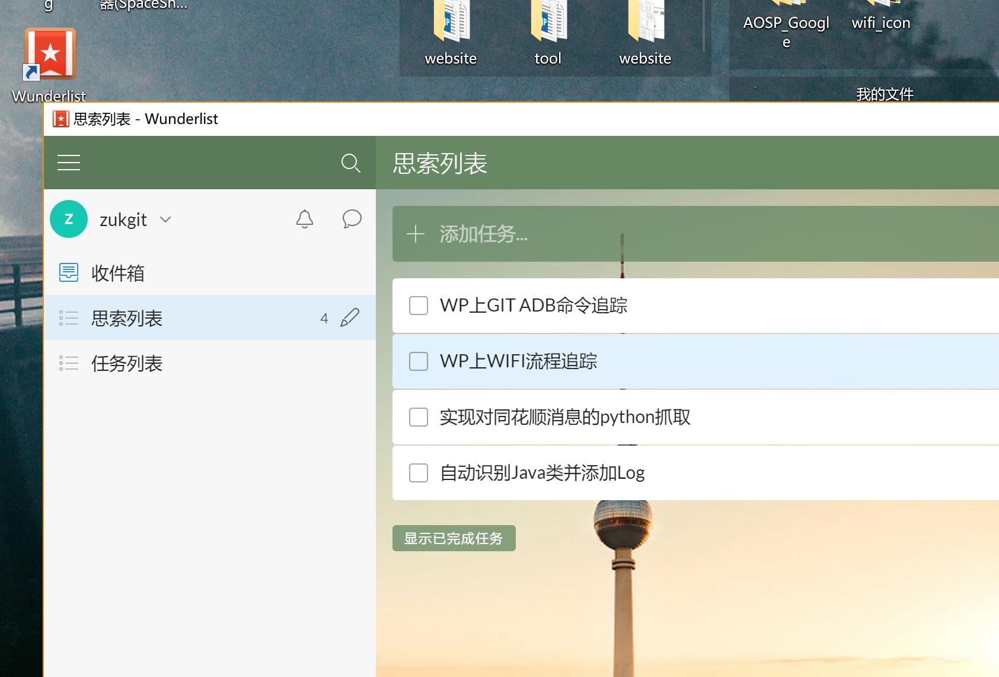

# Windows

## Analysis分析软件


### sourceinsight
Source Insight是一个面向项目开发的程序编辑器和代码浏览器，它拥有内置的对C/C++，C#和Java等程序的分析

[](https://pan.baidu.com/disk/home#/all?vmode=list&path=%2F%E8%BD%AF%E4%BB%B6%E5%BA%93%2FWindows%2F01.exe%E8%BD%AF%E4%BB%B6%E9%9B%86%E5%90%88%2F04.sourceinsight "sourceinsight网盘下载")


### UnderStand
UnderStand软件具有强大的代码静态分析功能，并且可以绘制各种流程图

https://pan.baidu.com/disk/home?adapt=pc&fr=ftw#/all?vmode=list&path=%2F%E8%BD%AF%E4%BB%B6%E5%BA%93%2FWindows%2F01.exe%E8%BD%AF%E4%BB%B6%E9%9B%86%E5%90%88%2F08.UnderStand


[](https://pan.baidu.com/disk/home?adapt=pc&fr=ftw#/all?vmode=list&path=%2F%E8%BD%AF%E4%BB%B6%E5%BA%93%2FWindows%2F01.exe%E8%BD%AF%E4%BB%B6%E9%9B%86%E5%90%88%2F08.UnderStand "UnderStand下载")


### Jd-Gui
JD-GUI中文破解版是一款功能强大的JAVA反编译工具,使用可帮助用户快速浏览重建源代码


[](https://github.com/ZukGit/SoftWare_Resource/blob/master/Windows/Analysis%E5%88%86%E6%9E%90%E8%BD%AF%E4%BB%B6/jd-gui.zip "JD_GUI下载")


## Browser浏览器


## Coding_编程软件


###   AndroidStudio

[](http://www.android-studio.org/index.php "androidstudio下载")


**下载地址:**
http://www.android-studio.org/index.php


---

###  DevC

Dev-C++是一个Windows环境下C&C++开发工具，它是一款自由软件，遵守GPL协议

[](https://pc.qq.com/detail/16/detail_163136.html "Devc下载")

https://pc.qq.com/detail/16/detail_163136.html

---
###  Eclipse
Eclipse 开放源代码的、基于 Java 的可扩展开发平台

[](https://www.eclipse.org/downloads/download.php?file=/oomph/epp/2018-09/Ra/eclipse-inst-win64.exe "eclipse")

**下载地址:**
https://www.eclipse.org/downloads/download.php?file=/oomph/epp/2018-09/Ra/eclipse-inst-win64.exe


---
###  WebStorm
WebStorm  是一款专业的HTML编辑工具基于InteliJ

[](https://www.jb51.net/softs/598714.html "WebStorm下载")


**下载地址:**
https://www.jb51.net/softs/598714.html


---
### pycharm 
pycharm  是 python语言开发集成环境
[](http://www.cncrk.com/downinfo/241055.html "pycharm下载")


**下载地址:**
http://www.cncrk.com/downinfo/241055.html


### ADB工具
```
ADB 工具 for windows；

ADB_1_0_26_windows
ADB_1_0_31_windows
ADB_1_0_32_windows
ADB_1_0_36_windows
ADB_1_0_39_windows
ADB_1_0_40_windows

```
**下载地址:**
git收藏

## Database数据库

###  SQLite Expert
安卓数据库.db 文件 数据库浏览器


[](https://pc.qq.com/detail/16/detail_22776.html "SQLite下载")


**下载地址:**
https://pc.qq.com/detail/16/detail_22776.html


---
## Editor编辑器

### notepad
notepad 是一款优秀文档编辑器

[](https://pc.qq.com/detail/6/detail_23026.html "notepad下载")

**下载地址:**
https://pc.qq.com/detail/6/detail_23026.html

---


### markdownpad2
markdownpad2 是 windows下 markdown语法编辑器  支持实时查看效果

[](http://markdownpad.com/download.html "markdownpad下载地址")


**下载地址:**
http://markdownpad.com/download.html

```
破解指南:   https://blog.csdn.net/zhensuyang/article/details/63683527

破解邮箱：Soar360@live.com

破解授权秘钥：
GBPduHjWfJU1mZqcPM3BikjYKF6xKhlKIys3i1MU2eJHqWGImDHzWdD6xhMNLGVpbP2M5SN6bnxn2kSE8qHqNY5QaaRxmO3YSMHxlv2EYpjdwLcPwfeTG7kUdnhKE0vVy4RidP6Y2wZ0q74f47fzsZo45JE2hfQBFi2O9Jldjp1mW8HUpTtLA2a5/sQytXJUQl/QKO0jUQY4pa5CCx20sV1ClOTZtAGngSOJtIOFXK599sBr5aIEFyH0K7H4BoNMiiDMnxt1rD8Vb/ikJdhGMMQr0R4B+L3nWU97eaVPTRKfWGDE8/eAgKzpGwrQQoDh+nzX1xoVQ8NAuH+s4UcSeQ==
```


---


### eDiary
eDiary 是一款小巧实用的电子日记本 软件已经迭代了十多年  很给力

[](http://www.haoxg.net/ediary/download.html "eDiary下载")


**下载地址: **
http://www.haoxg.net/ediary/download.html


### Wunderlist
奇妙清单Wunderlist是一款跨平台的云同步GTD工具。
他可以用来记录一些行程、记事提醒、工作安排、任务管理等任务，功能非常强大，界面简洁明晰、操作方便快捷

**下载地址: **
http://www.xue51.com/soft/8085.html

## Environment环境配置


## FileVersion_Manager文件版本管理

### Everything

[]( https://pc.qq.com/detail/2/detail_22042.html "everything下载")

**下载地址: **
 https://pc.qq.com/detail/2/detail_22042.html

---


### FileZilla
FileZilla是开放源码软件，具备所有的FTP软件功能，如：断点续传（如果服务器支持），自定义命令，站点管理等功能。


[](https://pc.qq.com/detail/6/detail_22246.html "FileZilla下载")

**下载地址: **
https://pc.qq.com/detail/6/detail_22246.html

---


### Clover
Clover是给文件管理器加上 Tab标签的软件
[](http://cn.ejie.me/ "Clover下载")

**下载地址: **
http://cn.ejie.me/


---

### QTTabBar
QTTabBar(多窗口文件管理器) 由于Clover在高分辨率下表现不好，QTTabBar能取代 Clover的功能 在高分辨率下
QTTabBar是一款能够让电脑资源管理器打开个标签页的工具，
QTTabBar中文版支持win7\win8\win10操作系统，在任务栏就不会因为资源管理器占用多个窗口，
QTTabBar还提供了一些功能插件，如文件操作工具、树型目录、显示状态栏等等！

**打开QTTabBar  文件管理器》查看》选项**


**添加路径到工具栏(重启时固定不变)**


**显示工具栏标签 文本**

**工具栏标签中删除**


**下载地址: **
http://www.pc6.com/softview/SoftView_633434.html


### NexusFile
NexusFile是一款来自于韩国免费的高效实用的 Windows 文件管理器，
类似于TotalCommander，完全可以用来替代 Windows 默认的简陋的资源管理器。

您可以很容易地复制或移动文件之间的文件夹，快速浏览到最喜爱的文件夹，
改变文件和文件夹的属性，执行先进的改名行动，管理档案和更多的工作。
[](http://www.pc6.com/softview/SoftView_20811.html "NexusFile下载")

**下载地址: **
http://www.pc6.com/softview/SoftView_20811.html

---

###  git
git是文件版本管理工具  github仓库使用命令
[](https://pc.qq.com/detail/13/detail_22693.html "git下载")

**下载地址: **
https://pc.qq.com/detail/13/detail_22693.html

### spacesniffer
SpaceSniffer是一个可以让您硬盘中文件和文件夹的分布情况的应用程序。
通过使用TreeMap的可视化布局，你可以直观地看到在你硬盘上大的文件和文件夹

**下载地址: **
http://www.pc6.com/softview/SoftView_28428.html

## Media多媒体

### Image图片


####  360浏览器自带截屏插件

[](https://browser.360.cn/se/ "360浏览器官网")

**下载地址:**
https://browser.360.cn/se/

---
#### ScreenToGif
ScreenToGif 是本地桌面录制gif照片的工具，操作简便

[

](http://www.pc6.com/softview/SoftView_104475.html "ScreenToGif下载")

**下载地址:**

http://www.pc6.com/softview/SoftView_104475.html

---

####  GifCam
一款非常简单好用的gif录制编辑软件
[](http://www.pc6.com/softview/SoftView_91910.html"GifCam下载地址")


**下载地址:**
http://www.pc6.com/softview/SoftView_91910.html

#### 美图看看
美图看看方便的图片浏览器

[](http://kankan.meitu.com/download.html "美图看看下载地址")


**下载地址：**
http://kankan.meitu.com/download.html

---

####  PhotoZoom Pro(图片无损放大软件)
通常的软件在放大图片时，总会降低图片的品质，而PhotoZoom Pro使用了S-Spline Max技术，这是一种拥有自动调节、高级插值算法的专利技术，可
以尽可能地提高放大图片的品质,PhotoZoom Pro的最大特色是可以对图片进行放大而没有锯齿、较少失真。
(可以把一张照片放大到 2TB 大小精度的软件 )


**下载地址：**
http://www.pc6.com/softview/SoftView_51017.html


####   HoneyView 

HoneyView 图片查看器  EXIF信息
[](http://www.pc6.com/softview/SoftView_138932.html "HoneyView下载")

http://www.pc6.com/softview/SoftView_138932.html


### Video视频

#### potplayer


[](https://pc.qq.com/detail/19/detail_519.html "potplayer下载地址")

**下载地址:**
https://pc.qq.com/detail/19/detail_519.html


### Audio音频


## Network_Capture无线抓包


### Omnipeek
**破解版-需要注册机生成序列号**

[
](https://pan.baidu.com/disk/home#/all?vmode=list&path=%2F%E8%BD%AF%E4%BB%B6%E5%BA%93%2FWindows%2F01.exe%E8%BD%AF%E4%BB%B6%E9%9B%86%E5%90%88%2F01.omnipeek%E6%97%A0%E7%BA%BF%E7%BD%91%E7%BB%9C%E6%95%B0%E6%8D%AE%E6%8A%93%E5%8F%96 "网盘下载omnipeek")

---

### WireShark
WireShark 是开源的网络包抓取软件 可抓取无线帧

[](https://pc.qq.com/detail/9/detail_6909.html "wireshark下载")


**软件下载地址：**
https://pc.qq.com/detail/9/detail_6909.html

**Wireshark源码下载地址：**
https://www.wireshark.org/download/src/

https://github.com/wireshark/wireshark


## Office 办公


### 万彩办公大师
[](http://www.wofficebox.com/?wancaiofficebox)
http://www.wofficebox.com/?wancaiofficebox


## 测试工具

### Iperf3 for windows
```
iperf3 -s                                                                root@DESKTOP-CN5OQSF
-----------------------------------------------------------
Server listening on 5201
-----------------------------------------------------------

```
下载地址: 
https://github.com/ZukGit/SoftWare_Resource/tree/master/Windows/
##  Other其他实用软件


### 迅雷破解版
迅雷破解版

[](https://pan.baidu.com/disk/home?adapt=pc&fr=ftw#/all?vmode=list&path=%2F%E8%BD%AF%E4%BB%B6%E5%BA%93%2FWindows%2F01.exe%E8%BD%AF%E4%BB%B6%E9%9B%86%E5%90%88%2F09.%E8%BF%85%E9%9B%B7%E7%A0%B4%E8%A7%A3%E7%89%88 "迅雷网盘下载")

https://pan.baidu.com/disk/home?adapt=pc&fr=ftw#/all?vmode=list&path=%2F%E8%BD%AF%E4%BB%B6%E5%BA%93%2FWindows%2F01.exe%E8%BD%AF%E4%BB%B6%E9%9B%86%E5%90%88%2F09.%E8%BF%85%E9%9B%B7%E7%A0%B4%E8%A7%A3%E7%89%88


---
###  StarryNote星空便签
星空便签是一款轻量级笔记软件，可以管理碎片信息和数据

[](http://www.pc6.com/softview/SoftView_405928.html "星空便签下载")


**软件下载地址：**
http://www.pc6.com/softview/SoftView_405928.html

---
### Renamer
ReNamer是一款小巧但功能强悍的免费文件更名软件
[](http://www.pc6.com/softview/SoftView_3511.html "renamer下载")


**软件下载地址：**
http://www.pc6.com/softview/SoftView_3511.html


---
### geogebra

geogebra 图形计算器是一款适合于各种教育背景用户使用的动态数学软件，他拥有着能将图形，数字，函数等理科科学以图像展现出来的强大软件
[](http://www.pc6.com/softview/SoftView_569737.html "geogebra下载")


**软件下载地址：**
http://www.pc6.com/softview/SoftView_569737.html


###  腾讯电脑管家桌面整理独立版

腾讯电脑管家桌面整理独立版 是小巧，使用方便的一款桌面整理工具。它可以帮助我们整理电脑桌面，让我们的桌面看起来更加整齐、清爽。

[](https://guanjia.qq.com/product/zmzl/)

**软件下载地址：**
https://guanjia.qq.com/product/zmzl/


### usbview
[](http://www.pc6.com/SoftView/SoftView_24606.html "GIt仓库")

USBDeview可以列出当前连接到你的计算机上或者曾经连接到你的计算机上的所有 USB 设备。
根据列出的设备的名称和描述，该软件能显示USB设备的串口号，设备添加的日期、生产日期以及最后连接电脑的日期以及其它信息。
**软件下载地址：**
http://www.pc6.com/SoftView/SoftView_24606.html


### deskpin
[](http://www.opdown.com/soft/99801.html DeskPin下载")

指定软件位于最顶 top 层
**软件下载地址：**
http://www.opdown.com/soft/99801.html

### Listary

Listary 是 Windows 下快速访问工具 类似 Mac下的 Afred ， 通过 double-ctrl 唤醒输入框，
另外还有一些快速访问文件的辅助功能
**软件下载地址：**
http://www.cncrk.com/downinfo/228819.html

### SpeedPan
SpeedPan 是第三方百度网盘登录工具， 可屏蔽网速限制，但是可能容易被官网屏蔽。

**软件下载地址：**
https://www.speedpan.com/


###  MonoCloud
MonoCloud 是一款VPN联网工具

**软件下载地址：**
**git收藏**


###  Dism++ 
Dism++ 就把这些常用的设置集合了起来，把这一切都变得更加简单方便
Dism++ 是一款 Windows 系统管理优化工具，它解决了我们安装、维护系统的一大痛点问题——自定义设置和优化。相当于一个 “一站式” 管理优化工具集

**软件下载地址：**
https://www.chuyu.me/zh-Hans/

###  TrafficMonitor
TrafficMonitor 电脑网速监控悬浮窗


**软件下载地址：**
http://www.pc6.com/softview/SoftView_568538.html

### MacType 字体
MacType 字体  肉眼舒服的字体 仿照IOS Mac


**软件下载地址：**
https://www.mactype.net/
# Linux


## 


## 


## 


# MacOS


## 


## 


## 


# IOS


## 


## 


## 


# Android


## VPN

### 小明VPN

**软件下载地址：**
https://github.com/xm19/v/blob/master/d.md
git收藏

## Tool

### Magiciperf
```
Magiciperf 是一款在安卓手机端运行 测试 wifi吞吐率的APK 。 结合 Iperf3 PC软件使用

命令:  -s -i 1 -p 5555

```

**软件下载地址：**
git收藏
https://github.com/ZukGit/SoftWare_Resource/blob/master/Android/iperf/magic_iperf.apk

## 

