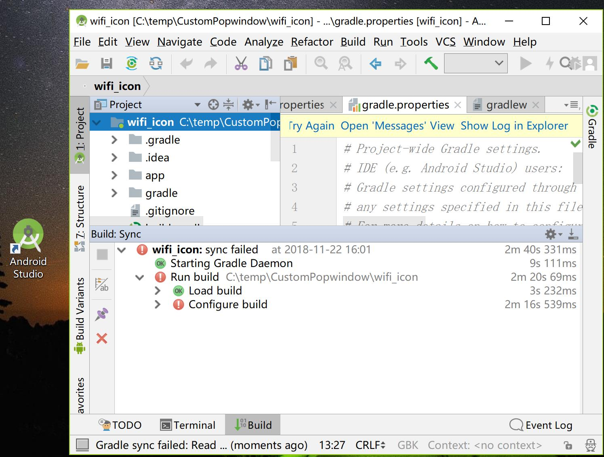
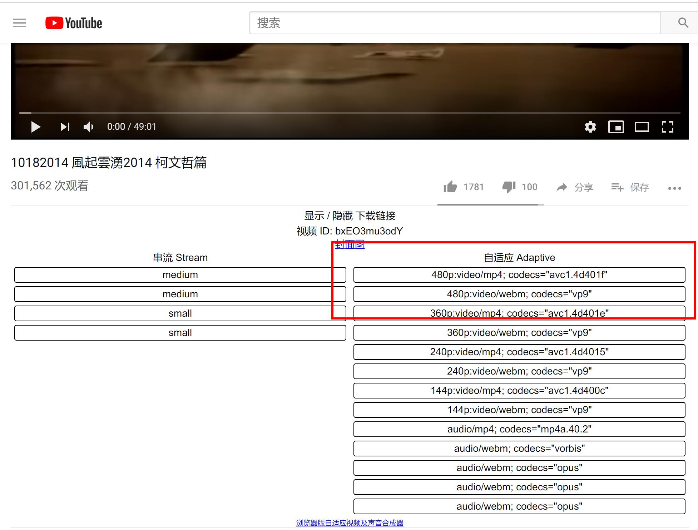

# Windows

## Analysis分析软件


### sourceinsight
Source Insight是一个面向项目开发的程序编辑器和代码浏览器，它拥有内置的对C/C++，C#和Java等程序的分析

[](https://pan.baidu.com/disk/home#/all?vmode=list&path=%2F%E8%BD%AF%E4%BB%B6%E5%BA%93%2FWindows%2F01.exe%E8%BD%AF%E4%BB%B6%E9%9B%86%E5%90%88%2F04.sourceinsight "sourceinsight网盘下载")


### UnderStand
UnderStand软件具有强大的代码静态分析功能，并且可以绘制各种流程图

https://pan.baidu.com/disk/home?adapt=pc&fr=ftw#/all?vmode=list&path=%2F%E8%BD%AF%E4%BB%B6%E5%BA%93%2FWindows%2F01.exe%E8%BD%AF%E4%BB%B6%E9%9B%86%E5%90%88%2F08.UnderStand


[](https://pan.baidu.com/disk/home?adapt=pc&fr=ftw#/all?vmode=list&path=%2F%E8%BD%AF%E4%BB%B6%E5%BA%93%2FWindows%2F01.exe%E8%BD%AF%E4%BB%B6%E9%9B%86%E5%90%88%2F08.UnderStand "UnderStand下载")


### Jd-Gui
JD-GUI中文破解版是一款功能强大的JAVA反编译工具,使用可帮助用户快速浏览重建源代码


[](https://github.com/ZukGit/SoftWare_Resource/blob/master/Windows/Analysis%E5%88%86%E6%9E%90%E8%BD%AF%E4%BB%B6/jd-gui.zip "JD_GUI下载")


## Browser浏览器


## Coding_编程软件


###   AndroidStudio

[](http://www.android-studio.org/index.php "androidstudio下载")


**下载地址:**
http://www.android-studio.org/index.php


---

###  DevC

Dev-C++是一个Windows环境下C&C++开发工具，它是一款自由软件，遵守GPL协议

[](https://pc.qq.com/detail/16/detail_163136.html "Devc下载")

https://pc.qq.com/detail/16/detail_163136.html

---
###  Eclipse
Eclipse 开放源代码的、基于 Java 的可扩展开发平台

[](https://www.eclipse.org/downloads/download.php?file=/oomph/epp/2018-09/Ra/eclipse-inst-win64.exe "eclipse")

**下载地址:**
https://www.eclipse.org/downloads/download.php?file=/oomph/epp/2018-09/Ra/eclipse-inst-win64.exe

---

###  InteliJ
intellij idea 2018是JetBrains公司旗下推出的一款java语言集成开发环境，是当下业内公认的最好用的java开发工具之一
[](http://www.cncrk.com/downinfo/236528.html "InteliJ")

**下载地址:**
http://www.cncrk.com/downinfo/236528.html

**破解文件地址**
git保存

**破解详情**
```
1. 在 Intelij安装目录的bin 文件 C:\Program Files\JetBrains\IntelliJ IDEA 2017.3.1\bin  复制 一个破解文件 JetbrainsCrack3.4.jar


2. 修改 idea64.exe.vmoptions 末尾添加一行 JetbrainsCrack3.4.jar
-Xms128m
-Xmx750m
-XX:ReservedCodeCacheSize=240m
-XX:+UseConcMarkSweepGC
-XX:SoftRefLRUPolicyMSPerMB=50
-ea
-Dsun.io.useCanonCaches=false
-Djava.net.preferIPv4Stack=true
-XX:+HeapDumpOnOutOfMemoryError
-XX:-OmitStackTraceInFastThrow
-javaagent:C:\Program Files\JetBrains\IntelliJ IDEA 2017.3.1\bin\JetbrainsCrack3.4.jar

在末尾添加 破解文件 JetbrainsCrack3.4.jar  路径需要具体修改
-javaagent:C:\Program Files\JetBrains\IntelliJ IDEA 2017.3.1\bin\JetbrainsCrack3.4.jar


3. 打开InteliJ 输入 Activate code 破解码


ThisCrackLicenseId-{
"licenseId":"ThisCrackLicenseId",
"licenseeName":"Admin",
"assigneeName":"",
"assigneeEmail":"avxhm.se@gmail.com",
"licenseRestriction":"Admin",
"checkConcurrentUse":false,
"products":[
{"code":"II","paidUpTo":"2099-12-31"},
{"code":"DM","paidUpTo":"2099-12-31"},
{"code":"AC","paidUpTo":"2099-12-31"},
{"code":"RS0","paidUpTo":"2099-12-31"},
{"code":"WS","paidUpTo":"2099-12-31"},
{"code":"DPN","paidUpTo":"2099-12-31"},
{"code":"RC","paidUpTo":"2099-12-31"},
{"code":"PS","paidUpTo":"2099-12-31"},
{"code":"DC","paidUpTo":"2099-12-31"},
{"code":"RM","paidUpTo":"2099-12-31"},
{"code":"CL","paidUpTo":"2099-12-31"},
{"code":"PC","paidUpTo":"2099-12-31"}
],
"hash":"2911276/0",
"gracePeriodDays":7,
"autoProlongated":false}

```


---
###  WebStorm
WebStorm  是一款专业的HTML编辑工具基于InteliJ

[](https://www.jb51.net/softs/598714.html "WebStorm下载")


**下载地址:**
https://www.jb51.net/softs/598714.html


---
### pycharm 
pycharm  是 python语言开发集成环境
[](http://www.cncrk.com/downinfo/241055.html "pycharm下载")

**pythonw环境下载**
Git保存 python-3.7.0-amd64.exe
```
 python-3.7.0-amd64.exe  安装首页 勾选  ADD To  PATH

```


**下载地址:**
http://www.cncrk.com/downinfo/241055.html


**破解文件地址**
Git保存
```
修改下载包文件中的 运行配置文件
pycharm.pjb/pycharm-professional-2017/pycharm-professional-2017.3.4/bin/pycharm.exe.vmoptions
pycharm.pjb/pycharm-professional-2017/pycharm-professional-2017.3.4/bin/pycharm64.exe.vmoptions

-Xms128m
-Xmx750m
-XX:ReservedCodeCacheSize=240m
-XX:+UseConcMarkSweepGC
-XX:SoftRefLRUPolicyMSPerMB=50
-ea
-Dsun.io.useCanonCaches=false
-Djava.net.preferIPv4Stack=true
-XX:+HeapDumpOnOutOfMemoryError
-XX:-OmitStackTraceInFastThrow
-javaagent:G:\software\pycharm.pjb\pycharm-professional-2017\pycharm-professional-2017.3.4\bin\JetbrainsCrack-2.8-release-enc.jar 


添加破解文件的路径如下:
-javaagent:G:\software\pycharm.pjb\pycharm-professional-2017\pycharm-professional-2017.3.4\bin\JetbrainsCrack-2.8-release-enc.jar 
```

**Activate codepo破解码**
```
{"licenseId":"ThisCrackLicenseId",
"licenseeName":"随便填",
"assigneeName":"随便填",
"assigneeEmail":"邮箱，随便填",
"licenseRestriction":"描述信息，随便填",
"checkConcurrentUse":false,
"products":[
{"code":"II","paidUpTo":"2099-12-31"},
{"code":"DM","paidUpTo":"2099-12-31"},
{"code":"AC","paidUpTo":"2099-12-31"},
{"code":"RS0","paidUpTo":"2099-12-31"},
{"code":"WS","paidUpTo":"2099-12-31"},
{"code":"DPN","paidUpTo":"2099-12-31"},
{"code":"RC","paidUpTo":"2099-12-31"},
{"code":"PS","paidUpTo":"2099-12-31"},
{"code":"DC","paidUpTo":"2099-12-31"},
{"code":"RM","paidUpTo":"2099-12-31"},
{"code":"CL","paidUpTo":"2099-12-31"},
{"code":"PC","paidUpTo":"2099-12-31"},
{"code":"DB","paidUpTo":"2099-12-31"},
{"code":"GO","paidUpTo":"2099-12-31"},
{"code":"RD","paidUpTo":"2099-12-31"}
],
"hash":"2911276/0",
"gracePeriodDays":7,
"autoProlongated":false}

```
**配置 Python Interpreter**
```
Setings  -> Project  Interpreter -> add(+)  local 
添加安装到本地的 python.exe 可执行文件
C:\Users\Administrator\AppData\Local\Programs\Python\Python37\python.exe
```


### ADB工具
```
ADB 工具 for windows；

ADB_1_0_26_windows
ADB_1_0_31_windows
ADB_1_0_32_windows
ADB_1_0_36_windows
ADB_1_0_39_windows
ADB_1_0_40_windows

```
**下载地址:**
git收藏


## Shell工具

### Cmder 
```

Cmder是一个Windows上命令行工具，

下载地址:    http://www.pc6.com/softview/SoftView_540099.html


　　cmder 功能极为强大，但从视窗画面上看不太出其强大实力，这里就先说下常用的功能：
　　如图示编号的部分说明如下：
1, Cmder常用快捷键
　　利用Tab，自动路径补全；
　　利用Ctrl+T建立新页签；利用Ctrl+W关闭页签;
　　利用Ctrl+Tab切换页签;
　　Alt+F4：关闭所有页签
　　Alt+Shift+1：开启cmd.exe
　　Alt+Shift+2：开启powershell.exe
　　Alt+Shift+3：开启powershell.exe (系统管理员权限)
　　Ctrl+1：快速切换到第1个页签
　　Ctrl+n：快速切换到第n个页签( n值无上限)
　　Alt + enter： 切换到全屏状态；
　　Ctr+r 历史命令搜索
2, 可在视窗内搜寻画面上出现过的任意关键字。
3, 新增页签按钮。
4, 切换页签按钮。
5, 锁定视窗，让视窗无法再输入。
6, 切换视窗是否提供卷轴功能，启动时可查询之前显示过的内容。
7, 按下滑鼠左键可开启系统选单，滑鼠右键可开启工具选项视窗。 Win+Alt+P  ：开启工具选项视窗 设置


每次进入到Cmder解压目录双击Cmder.exe打开的方式很麻烦，可以使用下面几种方式很好的解决问题；
　　1、把 Cmder 加到环境变量
　　把Cmder.exe存放的目录添加到系统环境变量；加完之后,Win+r一下输入cmder,即可。
　　2、添加 cmder 到右键菜单添加后在任意文件夹中即可打开Cmder，上一步的把 Cmder 加到环境变量就是为此服务的, 在管理员权限的终端输入以下语句即可:
　　Cmder.exe /REGISTER ALL                   // 右键菜单加入 cmder
　　3、为Cmder.exe创建快捷方式，右击Cmder.exe选择“创建快捷方式”点击即可，以后打开Cmder.exe只要点击桌面对应的快捷方式即可


```
```
Win+Alt+P   设置
Main 》Size : 20
Main 》Appearance 》 Scrollbar -> Hide
Main 》Appearance 》 TitleBar -> Hide caption always


```
[](http://www.pc6.com/softview/SoftView_540099.html "Cmder下载")

## Database数据库

###  SQLite Expert
安卓数据库.db 文件 数据库浏览器


[](https://pc.qq.com/detail/16/detail_22776.html "SQLite下载")


**下载地址:**
https://pc.qq.com/detail/16/detail_22776.html


---
## Editor编辑器

### notepad
notepad 是一款优秀文档编辑器

[](https://pc.qq.com/detail/6/detail_23026.html "notepad下载")

**下载地址:**
https://pc.qq.com/detail/6/detail_23026.html

---


### markdownpad2
markdownpad2 是 windows下 markdown语法编辑器  支持实时查看效果

[](http://markdownpad.com/download.html "markdownpad下载地址")


**下载地址:**
http://markdownpad.com/download.html

```
破解指南:   https://blog.csdn.net/zhensuyang/article/details/63683527

破解邮箱：Soar360@live.com

破解授权秘钥：
GBPduHjWfJU1mZqcPM3BikjYKF6xKhlKIys3i1MU2eJHqWGImDHzWdD6xhMNLGVpbP2M5SN6bnxn2kSE8qHqNY5QaaRxmO3YSMHxlv2EYpjdwLcPwfeTG7kUdnhKE0vVy4RidP6Y2wZ0q74f47fzsZo45JE2hfQBFi2O9Jldjp1mW8HUpTtLA2a5/sQytXJUQl/QKO0jUQY4pa5CCx20sV1ClOTZtAGngSOJtIOFXK599sBr5aIEFyH0K7H4BoNMiiDMnxt1rD8Vb/ikJdhGMMQr0R4B+L3nWU97eaVPTRKfWGDE8/eAgKzpGwrQQoDh+nzX1xoVQ8NAuH+s4UcSeQ==
```


---


### eDiary
eDiary 是一款小巧实用的电子日记本 软件已经迭代了十多年  很给力

[](http://www.haoxg.net/ediary/download.html "eDiary下载")


**下载地址: **
http://www.haoxg.net/ediary/download.html


### Wunderlist
奇妙清单Wunderlist是一款跨平台的云同步GTD工具。
他可以用来记录一些行程、记事提醒、工作安排、任务管理等任务，功能非常强大，界面简洁明晰、操作方便快捷

**下载地址: **
http://www.xue51.com/soft/8085.html


### Hex_Editor
```
Hex Editor Neo 可以查看，修改，分析您的十六进制和二进制数据文件，编辑，与其他应用程序通过剪贴板，插入新的数据，
交换数据和删除现有数据，以及执行其他编辑操作。

  下载地址:  http://www.pc6.com/softview/SoftView_22215.html

```
[](http://www.pc6.com/softview/SoftView_22215.html"Hex_Editor下载")


## Environment环境配置


## FileVersion_Manager文件版本管理

### Everything

[]( https://pc.qq.com/detail/2/detail_22042.html "everything下载")

**下载地址: **
 https://pc.qq.com/detail/2/detail_22042.html

---


### FileZilla
FileZilla是开放源码软件，具备所有的FTP软件功能，如：断点续传（如果服务器支持），自定义命令，站点管理等功能。


[](https://pc.qq.com/detail/6/detail_22246.html "FileZilla下载")

**下载地址: **
https://pc.qq.com/detail/6/detail_22246.html

---


### Clover
Clover是给文件管理器加上 Tab标签的软件
[](http://cn.ejie.me/ "Clover下载")

**下载地址: **
http://cn.ejie.me/


### Droplt
```
Droplt是一款可以将文件分类管理的工具，这款软件操作界面比较简单，
打开以后可以自动显示处理的图标，例如您选择媒体文件分类，
软件就自动切换的“音乐图标”如果您选择图片分类，那么软件也会显示“照片图标”
这样您就可以知道自己正在执行的任务类型了；Droplt(文件分类管理)支持六种分类方式，
可以选择压缩器、照片陈列室制作器等工具帮助您完成分类工作，
也可以利用扫描的功能将一个文件夹里面的资源按照一定的规则分类！
```
[](http://www.pc0359.cn/downinfo/86096.html "Droplt下载")

**下载地址: **
http://www.pc0359.cn/downinfo/86096.html


---

### QTTabBar
QTTabBar(多窗口文件管理器) 由于Clover在高分辨率下表现不好，QTTabBar能取代 Clover的功能 在高分辨率下
QTTabBar是一款能够让电脑资源管理器打开个标签页的工具，
QTTabBar中文版支持win7\win8\win10操作系统，在任务栏就不会因为资源管理器占用多个窗口，
QTTabBar还提供了一些功能插件，如文件操作工具、树型目录、显示状态栏等等！

**打开QTTabBar  文件管理器》查看》选项**


**添加路径到工具栏(重启时固定不变)**


**显示工具栏标签 文本**

**工具栏标签中删除**


**下载地址: **
http://www.pc6.com/softview/SoftView_633434.html


### NexusFile
NexusFile是一款来自于韩国免费的高效实用的 Windows 文件管理器，
类似于TotalCommander，完全可以用来替代 Windows 默认的简陋的资源管理器。

您可以很容易地复制或移动文件之间的文件夹，快速浏览到最喜爱的文件夹，
改变文件和文件夹的属性，执行先进的改名行动，管理档案和更多的工作。
[](http://www.pc6.com/softview/SoftView_20811.html "NexusFile下载")

**下载地址: **
http://www.pc6.com/softview/SoftView_20811.html

---

###  git
git是文件版本管理工具  github仓库使用命令
[](https://pc.qq.com/detail/13/detail_22693.html "git下载")

**下载地址: **
https://pc.qq.com/detail/13/detail_22693.html

### spacesniffer
SpaceSniffer是一个可以让您硬盘中文件和文件夹的分布情况的应用程序。
通过使用TreeMap的可视化布局，你可以直观地看到在你硬盘上大的文件和文件夹

**下载地址: **
http://www.pc6.com/softview/SoftView_28428.html

## Media多媒体

### Image图片


####  360浏览器自带截屏插件

[](https://browser.360.cn/se/ "360浏览器官网")

**下载地址:**
https://browser.360.cn/se/

---
#### ScreenToGif
ScreenToGif 是本地桌面录制gif照片的工具，操作简便

[

](http://www.pc6.com/softview/SoftView_104475.html "ScreenToGif下载")

**下载地址:**

http://www.pc6.com/softview/SoftView_104475.html

---

####  GifCam
一款非常简单好用的gif录制编辑软件
[](http://www.pc6.com/softview/SoftView_91910.html"GifCam下载地址")


**下载地址:**
http://www.pc6.com/softview/SoftView_91910.html

#### 美图看看
美图看看方便的图片浏览器

[](http://kankan.meitu.com/download.html "美图看看下载地址")


**下载地址：**
http://kankan.meitu.com/download.html

---

####  PhotoZoom Pro(图片无损放大软件)
通常的软件在放大图片时，总会降低图片的品质，而PhotoZoom Pro使用了S-Spline Max技术，这是一种拥有自动调节、高级插值算法的专利技术，可
以尽可能地提高放大图片的品质,PhotoZoom Pro的最大特色是可以对图片进行放大而没有锯齿、较少失真。
(可以把一张照片放大到 2TB 大小精度的软件 )


**下载地址：**
http://www.pc6.com/softview/SoftView_51017.html


####   HoneyView 

HoneyView 图片查看器  EXIF信息
[](http://www.pc6.com/softview/SoftView_138932.html "HoneyView下载")

http://www.pc6.com/softview/SoftView_138932.html


### Video视频

#### potplayer


[](https://pc.qq.com/detail/19/detail_519.html "potplayer下载地址")

**下载地址:**
https://pc.qq.com/detail/19/detail_519.html


### Audio音频


## Network_Capture无线抓包


### Omnipeek
**破解版-需要注册机生成序列号**

[
](https://pan.baidu.com/disk/home#/all?vmode=list&path=%2F%E8%BD%AF%E4%BB%B6%E5%BA%93%2FWindows%2F01.exe%E8%BD%AF%E4%BB%B6%E9%9B%86%E5%90%88%2F01.omnipeek%E6%97%A0%E7%BA%BF%E7%BD%91%E7%BB%9C%E6%95%B0%E6%8D%AE%E6%8A%93%E5%8F%96 "网盘下载omnipeek")

---

### WireShark
WireShark 是开源的网络包抓取软件 可抓取无线帧

[](https://pc.qq.com/detail/9/detail_6909.html "wireshark下载")


**软件下载地址：**
https://pc.qq.com/detail/9/detail_6909.html

**Wireshark源码下载地址：**
https://www.wireshark.org/download/src/

https://github.com/wireshark/wireshark


## Office 办公


### 万彩办公大师
[](http://www.wofficebox.com/?wancaiofficebox)
http://www.wofficebox.com/?wancaiofficebox


## 测试工具

### Iperf3 for windows
```
iperf3 -s                                                                root@DESKTOP-CN5OQSF
-----------------------------------------------------------
Server listening on 5201
-----------------------------------------------------------

```
下载地址: 
https://github.com/ZukGit/SoftWare_Resource/tree/master/Windows/


## IOS工具软件
```
爱思助手

　爱思助手是一款具有刷机、越狱、资料管理、应用游戏资源下载于一体的苹果设备管理工具，
爱思助手可以免费为苹果用户提供百万正版苹果软件、热门游戏、苹果铃声、高清壁纸，免 AppIe ID 一键高速下载；
更具有反激活、读设备开机密码、解除iPhone已停用、备份SHSH等强大苹果设备故障处理功能，是苹果玩家必备管理工具。

http://www.pc6.com/softview/SoftView_81369.html

```
[](http://www.pc6.com/softview/SoftView_81369.html)

## USB工具

### usbview
[](http://www.pc6.com/SoftView/SoftView_24606.html "GIt仓库")

USBDeview可以列出当前连接到你的计算机上或者曾经连接到你的计算机上的所有 USB 设备。
根据列出的设备的名称和描述，该软件能显示USB设备的串口号，设备添加的日期、生产日期以及最后连接电脑的日期以及其它信息。
**软件下载地址：**
http://www.pc6.com/SoftView/SoftView_24606.html


### U盘被写保护解除工具
```
1. 使用 usboot 把U盘清零
2. 使用 ChipGenius 查看U 盘生产厂
3. 搜索U盘量产工具进行 低级格式化 (厂商不同 版本不同 都可能影响格式化)


```
#### usboot
完全擦除U盘数据为0 内置MSDOS7.1 可把U盘做成启动盘

[](http://www.pc6.com/softview/SoftView_5044.html)


**软件下载地址(git 收藏)：**
http://www.pc6.com/softview/SoftView_5044.html


#### ChipGenius
ChipGenius是u盘主控芯片检测工具，可以查询U盘、MP3/MP4等Flash存储设备的主控芯片的所有信息，
包括芯片厂商、芯片型号、相关在线资料、电力消耗等信息。当然也可以查询USB设备的VID/PID信息、设备名称、序列号、设备版本等等

[](http://www.pc6.com/softview/SoftView_46264.html)
**软件下载地址(git 收藏)：**
http://www.pc6.com/softview/SoftView_46264.html


#### 主控厂商: AlcorMicro 量产工具

[](https://github.com/ZukGit/SoftWare_Resource/tree/master/Windows)
**软件下载地址(git 收藏)：**

## PE工具
```
PE系统一般指Windows PE 
Windows Preinstallation Environment（Windows PE），Windows预安装环境，是带有有限服务的最小Win32子系统
Windows PE 不是设计为计算机上的主要操作系统，而是作为独立的预安装环境和其他安装程序和恢复技术
Windows PE的作用是使用在大量的计算机安装（同规格之计算机），以达到快速且一致性的安装
.第一，操作系统损坏无法进入的情况下启动硬盘上的Windows PE可以方便地修复
Windows PE启动相当快捷，而且对启动环境要求不高；其功能几乎相当于安装了一个 Windows 的命令行版本。
因此，对于个人计算机用户，只要将其写入U盘（或刻录在一张光碟上），便可放心地去解决初始化系统之类的问题
```

### 大白菜PE
```
大白菜超级U盘启动制作工具，是纯傻瓜式制作U盘启动功能的超级万能王 集成一键装机，硬盘数据恢复，密码破解，等等实用的程序

```
[](http://www.pc6.com/softview/SoftView_51495.html)

**软件下载地址：**
http://www.pc6.com/softview/SoftView_51495.html
http://www.winbaicai.com/

### UltraISO软碟通
```
UltraISO，中文名软碟通，是一款功能强大而又方便实用的光盘映像文件制作/编辑/格式转换工具，
它可以直接编辑光盘映像和从映像中直接提取文件，也可以从cd-rom制作光盘映像或者将硬盘上的文件制作成iso文件。
同时，你也可以处理iso文件的启动信息，从而制作可引导光盘。


```

[](http://www.pc6.com/softview/SoftView_67274.html)

**软件下载地址：**
http://www.pc6.com/softview/SoftView_67274.html


### EasyBCD
```
EasyBCD(系统引导修复工具)
直接从镜像文件启动电脑


```

[](http://www.pc6.com/softview/SoftView_53180.html)

**软件下载地址：**
http://www.pc6.com/softview/SoftView_53180.html

## 安装Linux系统

### 安装 Deepin-Linux 系统

```
Deepin 官网:                  https://www.deepin.org/
Deepin iso镜像下载地址:        https://www.deepin.org/download/
制作安装Deepin系统安装U盘工具 deepin-boot-maker.exe  http://cdimage.deepin.com/applications/deepin-boot-maker/windows/deepin-boot-maker.exe

```
####  deepin-boot-maker
[](http://cdimage.deepin.com/applications/deepin-boot-maker/windows/deepin-boot-maker.exe)

```
使用教程:
1. 下载 deepin.iso 镜像文件 ( 2.5GB )  https://www.deepin.org/download/
2.  下载 deepin-boot-maker.exe  制作安装Deepin系统安装U盘工具
3.  插入U盘 启动deepin-boot-maker.exe   选中 deepin.iso 镜像
4.  在 电脑》管理》磁盘管理 中对磁盘进行新建卷  必须留两个空白磁盘 ，例如空白 E:  空白F: ,  这两个磁盘将会作为 Linux系统的挂载点 根目录/   和主目录 /home 的挂载点

			挂载点	   挂载点中文名	     文件系统	      大小
			/	       根分区（必选）	 EXT4（推荐）	最少10G
			/home	   家目录（推荐）	 EXT4（推荐）	最少10G


5.  电脑进入BIOS中  设置以 USB为启动盘
6.  进入安装 Deepin系统 在Linux的安装磁盘中选择   空间较大的挂载 /home   选择空间较小的盘 加载系统根目录  /  并选中文件格式为  ext4
7.  等待安装完成后重启电脑
8.  此时可能会出现 grub error  no find file xxxx  此时参考
    https://www.cnblogs.com/sting2me/p/4216935.html    Ubuntu 开机启动是出现 grub rescue 解决办法 输入如下命令 

[1]. 先使用ls命令，找到Ubuntu的安装在哪个分区，ls会罗列所有的磁盘分区信息，比方说：
【 前缀 grub rescue> 】  ls
  (hd0),(hd0,msdos3),(hd0,msdos2),(hd0,msdos1)

[2].然后依次调用如下命令： msdosX表示各个分区，注意 msdos 与 数字 之间没有空格！  
   假设找到（hd0,msdos3）时，显示了文件夹中的文件，则表示 Linux 安装在这个分区
【 前缀 grub rescue> 】 ls (hd0,msdosX)/boot/grub    
   ...config  ....ipc  ....linux
[3].假设找到（hd0,msdos3）时执行
【 前缀 grub rescue> 】    rescue>set root=(hd0,msdos3)
【 前缀 grub rescue> 】    rescue>set prefix=(hd0,msdos3)/boot/grub
【 前缀 grub rescue> 】    rescue>insmod normal
【 前缀 grub rescue> 】    normal              // 【开始进入Linux引导】

[4]. 成功进入Linux 后执行 如下命令  完成 grub的修正 ， 重启测试是否已经恢复了grub的启动菜单 ， 如果跳过该步骤重启会再次进入grub
   sudo update-grub
   sudo grub-install /dev/sda                // sda 硬盘号码

```

**软件下载地址：**
http://cdimage.deepin.com/applications/deepin-boot-maker/windows/deepin-boot-maker.exe


## VPN软件

###  MonoCloud
MonoCloud 是一款VPN联网工具

**软件下载地址：**
**git收藏**

###  Cisco AnyConnect 
Cisco AnyConnect  是一款思科出品 VPN联网工具

**软件下载地址：**
**git收藏**


##  Other其他实用软件


### 迅雷破解版
迅雷破解版

[](https://pan.baidu.com/disk/home?adapt=pc&fr=ftw#/all?vmode=list&path=%2F%E8%BD%AF%E4%BB%B6%E5%BA%93%2FWindows%2F01.exe%E8%BD%AF%E4%BB%B6%E9%9B%86%E5%90%88%2F09.%E8%BF%85%E9%9B%B7%E7%A0%B4%E8%A7%A3%E7%89%88 "迅雷网盘下载")

https://pan.baidu.com/disk/home?adapt=pc&fr=ftw#/all?vmode=list&path=%2F%E8%BD%AF%E4%BB%B6%E5%BA%93%2FWindows%2F01.exe%E8%BD%AF%E4%BB%B6%E9%9B%86%E5%90%88%2F09.%E8%BF%85%E9%9B%B7%E7%A0%B4%E8%A7%A3%E7%89%88


---
###  StarryNote星空便签
星空便签是一款轻量级笔记软件，可以管理碎片信息和数据

[](http://www.pc6.com/softview/SoftView_405928.html "星空便签下载")


**软件下载地址：**
http://www.pc6.com/softview/SoftView_405928.html

---
### Renamer
ReNamer是一款小巧但功能强悍的免费文件更名软件
[](http://www.pc6.com/softview/SoftView_3511.html "renamer下载")


**软件下载地址：**
http://www.pc6.com/softview/SoftView_3511.html


---
### geogebra

geogebra 图形计算器是一款适合于各种教育背景用户使用的动态数学软件，他拥有着能将图形，数字，函数等理科科学以图像展现出来的强大软件
[](http://www.pc6.com/softview/SoftView_569737.html "geogebra下载")


**软件下载地址：**
http://www.pc6.com/softview/SoftView_569737.html


###  腾讯电脑管家桌面整理独立版

腾讯电脑管家桌面整理独立版 是小巧，使用方便的一款桌面整理工具。它可以帮助我们整理电脑桌面，让我们的桌面看起来更加整齐、清爽。

[](https://guanjia.qq.com/product/zmzl/)

**软件下载地址：**
https://guanjia.qq.com/product/zmzl/


### deskpin
[](http://www.opdown.com/soft/99801.html DeskPin下载")

指定软件位于最顶 top 层
**软件下载地址：**
http://www.opdown.com/soft/99801.html

### Listary

Listary 是 Windows 下快速访问工具 类似 Mac下的 Afred ， 通过 double-ctrl 唤醒输入框，
另外还有一些快速访问文件的辅助功能
**软件下载地址：**
http://www.cncrk.com/downinfo/228819.html

### SpeedPan
SpeedPan 是第三方百度网盘登录工具， 可屏蔽网速限制，但是可能容易被官网屏蔽。

**软件下载地址：**
https://www.speedpan.com/


###  Dism++ 
Dism++ 就把这些常用的设置集合了起来，把这一切都变得更加简单方便
Dism++ 是一款 Windows 系统管理优化工具，它解决了我们安装、维护系统的一大痛点问题——自定义设置和优化。相当于一个 “一站式” 管理优化工具集

**软件下载地址：**
https://www.chuyu.me/zh-Hans/

###  TrafficMonitor
TrafficMonitor 电脑网速监控悬浮窗


**软件下载地址：**
http://www.pc6.com/softview/SoftView_568538.html

### MacType 字体
MacType 字体  肉眼舒服的字体 仿照IOS Mac


**软件下载地址：**
https://www.mactype.net/


## Virtual虚拟机

### VMWare

```
VMWare虚拟机软件是一个“虚拟PC”软件，它使你可以在一台机器上同时运行二个或更多Windows、DOS、LINUX系统。与“多启动”系统相比，
VMWare采用了完全不同的概念。多启动系统在一个时刻只能运行一个系统，在系统切换时需要重新启动机器。

VMware 12 专业版永久许可证密钥
VMware Workstation v12 for Windows 
5A02H-AU243-TZJ49-GTC7K-3C61N 
VF5XA-FNDDJ-085GZ-4NXZ9-N20E6
UC5MR-8NE16-H81WY-R7QGV-QG2D8
ZG1WH-ATY96-H80QP-X7PEX-Y30V4
AA3E0-0VDE1-0893Z-KGZ59-QGAVF
```
**软件下载地址：**
**git收藏**


# Linux


## VPN

### Electron-SSR
```

首先打开系统终端，输入命令 sudo apt install git 安装 Git

继续在终端中使用 Git Clone 命令下载 SSRR git clone https://github.com/shadowsocksrr/shadowsocksr.git 
请注意此处 git clone 保存的 SSRR 源码位置，默认存放于 /home/username/shadowsocksr

下载 Electron-SSR，请根据自己的 Linux 发行版来选择，Debian 或 Ubuntu 选择 deb 包即可
electron-ssr_0.2.4_amd64.deb
https://storage.monocloud.co/client/Linux/electron-ssr_0.2.4_amd64.deb

以上为我们提供的下载地址，如果你想要更多的下载选择，请移步 Github 的对应项目下载页：https://github.com/erguotou520/electron-ssr/releases

最后在 Linux 系统网络设置  PAC 自动代理  
```


## 


## zsh

###  最初主目录 ~列表
```
pwd
/home/zukgit


ls -la
total 8
drwxr-xr-x 1 zukgit zukgit 4096 Jan  8 12:50 .
drwxr-xr-x 1 root   root   4096 Jan  8 12:43 ..
-rw------- 1 zukgit zukgit   23 Jan  8 12:50 .bash_history
-rw-r--r-- 1 zukgit zukgit  220 Jan  8 12:43 .bash_logout
-rw-r--r-- 1 zukgit zukgit 3771 Jan  8 12:43 .bashrc
-rw-r--r-- 1 zukgit zukgit  807 Jan  8 12:43 .profile
-rw-r--r-- 1 zukgit zukgit    0 Jan  8 12:50 .sudo_as_admin_successful

```


### root权限安装 zsh
```
1.安装zsh                         sudo apt-get install zsh                     
2.安装oh-my-zsh                   sh -c "$(curl -fsSL https://raw.github.com/robbyrussell/oh-my-zsh/master/tools/install.sh)"
3.普通用户下安装antigen            curl -L git.io/antigen > ~/antigen.zsh
4.执行 antigen生成 .antigen文件    source     ~/antigen.zsh
5.执行命令                         antigen use oh-my-zsh


6. 编辑 ~/.zshrc 文件

###############客制化开始#################

##############1.alias 别名设置区域##########
alias  cls="clear"
alias  findm="grep -rnws --include='*.[mb][kp]' 'LOCAL_MODULE\|LOCAL_PACKAGE_NAME\|name:'"
alias  cdd="cd /mnt/c/Users/aaa/Desktop"                   
alias  cddd="cd /mnt/d/"
alias  la="ls -la"

##############2. 自定义环境变量
export PATH=$PATH:/mnt/c/Users/aaa/Desktop/bin            ## 把桌面的bin文件夹 加入到PATH变量
##############3. antigen设置区域##########
chmod -R 755 ~/ 
chmod -R 755 ~/.antigen   ##  避免zsh compinit: insecure directories 警告
source     ~/antigen.zsh  ## 执行antigen 用于初始化 antigen的环境

## 通过 antigen 加载 oh-my-zsh库
antigen use oh-my-zsh

## 加载原版oh-my-zsh中的功能
antigen bundle git
antigen bundle heroku
antigen bundle pip
antigen bundle lein
antigen bundle command-not-found

antigen bundle zsh-users/zsh-syntax-highlighting  #语法高亮功能
antigen bundle zsh-users/zsh-autosuggestions   #代码提示功能
antigen bundle zsh-users/zsh-completions   #自动补全功能
antigen theme robbyrussell/oh-my-zsh themes/dallas
antigen apply     # 保存当前设置 并进行生效设置

################## ls 命令配色
LS_COLORS='rs=0:di=01;34:ln=01;36:mh=00:pi=40;33:so=31;01:do=31;01:bd=40;33;01:cd=40;33;01:or=40;31;01:mi=00:su=37;41:sg=30;43:ca=30;41:tw=30;42:ow=34;42:st=37;44:ex=01;37:*.tar=01;31:*.tgz=01;31:*.arc=01;31:*.arj=01;31:*.taz=01;31:*.lha=01;31:*.lz4=01;31:*.lzh=01;31:*.lzma=01;31:*.tlz=01;31:*.txz=01;31:*.tzo=01;31:*.t7z=01;31:*.zip=01;31:*.z=01;31:*.Z=01;31:*.dz=01;31:*.gz=01;31:*.lrz=01;31:*.lz=01;31:*.lzo=01;31:*.xz=01;31:*.zst=01;31:*.tzst=01;31:*.bz2=01;31:*.bz=01;31:*.tbz=01;31:*.tbz2=01;31:*.tz=01;31:*.deb=01;31:*.rpm=01;31:*.jar=01;31:*.war=01;31:*.ear=01;31:*.sar=01;31:*.rar=01;31:*.alz=01;31:*.ace=01;31:*.zoo=01;31:*.cpio=01;31:*.7z=01;31:*.rz=01;31:*.cab=01;31:*.wim=01;31:*.swm=01;31:*.dwm=01;31:*.esd=01;31:*.jpg=31;01:*.jpeg=31;01:*.mjpg=31;01:*.mjpeg=31;01:*.gif=31;01:*.bmp=31;01:*.pbm=31;01:*.pgm=31;01:*.ppm=31;01:*.tga=31;01:*.xbm=31;01:*.xpm=31;01:*.tif=31;01:*.tiff=31;01:*.png=31;01:*.svg=31;01:*.svgz=31;01:*.mng=31;01:*.pcx=31;01:*.mov=31;01:*.mpg=31;01:*.mpeg=31;01:*.m2v=31;01:*.mkv=31;01:*.webm=31;01:*.ogm=31;01:*.mp4=31;01:*.m4v=31;01:*.mp4v=31;01:*.vob=31;01:*.qt=31;01:*.nuv=31;01:*.wmv=31;01:*.asf=31;01:*.rm=31;01:*.rmvb=31;01:*.flc=31;01:*.avi=31;01:*.fli=31;01:*.flv=31;01:*.gl=31;01:*.dl=31;01:*.xcf=31;01:*.xwd=31;01:*.yuv=31;01:*.cgm=31;01:*.emf=31;01:*.ogv=31;01:*.ogx=31;01:*.aac=00;36:*.au=00;36:*.flac=00;36:*.m4a=00;36:*.mid=00;36:*.midi=00;36:*.mka=00;36:*.mp3=00;36:*.mpc=00;36:*.ogg=00;36:*.ra=00;36:*.wav=00;36:*.oga=00;36:*.opus=00;36:*.spx=00;36:*.xspf=00;36:'

PS1="[zukgit-\`pwd\`]"
###############客制化结束#################


7. 添加权限 【每次修改~/.zshrc 都需要另外执行】                      chmod -R 755 ~/.antigen && chmod -R 755 ~/


8. 背景颜色
RGB 
R: 88
G: 86
L: 185


```
#### 执行操作后主目录
```
1.2.3 步骤后
 ls -la
total 236
drwxr-xr-x 1 zukgit zukgit  4096 Jan  8 14:43 .
drwxr-xr-x 1 root   root    4096 Jan  8 12:43 ..
-rw------- 1 zukgit zukgit    23 Jan  8 12:50 .bash_history
-rw-r--r-- 1 zukgit zukgit   220 Jan  8 12:43 .bash_logout
-rw-r--r-- 1 zukgit zukgit  3771 Jan  8 12:43 .bashrc
drwxr-xr-x 1 zukgit zukgit  4096 Jan  8 14:41 .oh-my-zsh        //【新增】
-rw-r--r-- 1 zukgit zukgit   807 Jan  8 12:43 .profile
-rw-r--r-- 1 zukgit zukgit     0 Jan  8 12:50 .sudo_as_admin_successful
-rw-r--r-- 1 zukgit zukgit 42275 Jan  8 14:41 .zcompdump         //【新增】
-rw-r--r-- 1 zukgit zukgit 42275 Jan  8 14:41 .zcompdump-DESKTOP-CN5OQSF-5.4.2
-rw------- 1 zukgit zukgit   153 Jan  8 14:43 .zsh_history    //【新增】
-rw-r--r-- 1 zukgit zukgit  3404 Jan  8 14:41 .zshrc          //【新增】
-rw-r--r-- 1 zukgit zukgit 58503 Jan  8 14:42 antigen.zsh      //【新增】


4.  source     ~/antigen.zsh
4.步骤后


ls -la
total 236
drwxr-xr-x 1 zukgit zukgit  4096 Jan  8 14:45 .
drwxr-xr-x 1 root   root    4096 Jan  8 12:43 ..
drwxr-xr-x 1 zukgit zukgit  4096 Jan  8 14:45 .antigen   // 【新增目录】 包含有bundle目录
-rw------- 1 zukgit zukgit    23 Jan  8 12:50 .bash_history
-rw-r--r-- 1 zukgit zukgit   220 Jan  8 12:43 .bash_logout
-rw-r--r-- 1 zukgit zukgit  3771 Jan  8 12:43 .bashrc
drwxr-xr-x 1 zukgit zukgit  4096 Jan  8 14:41 .oh-my-zsh
-rw-r--r-- 1 zukgit zukgit   807 Jan  8 12:43 .profile
-rw-r--r-- 1 zukgit zukgit     0 Jan  8 12:50 .sudo_as_admin_successful
-rw-r--r-- 1 zukgit zukgit 42275 Jan  8 14:41 .zcompdump
-rw-r--r-- 1 zukgit zukgit 42275 Jan  8 14:41 .zcompdump-DESKTOP-CN5OQSF-5.4.2
-rw------- 1 zukgit zukgit   215 Jan  8 14:45 .zsh_history
-rw-r--r-- 1 zukgit zukgit  3404 Jan  8 14:41 .zshrc
-rw-r--r-- 1 zukgit zukgit 58503 Jan  8 14:42 antigen.zsh


```
#### ls 命令显示的颜色
```
echo $LS_COLORS    // ls显示的文件名的颜色、是变量LS_COLORS控制


LS_COLORS='rs=0:di=01;34:ln=01;36:mh=00:pi=40;33:so=31;01:do=31;01:bd=40;33;01:cd=40;33;01:or=40;31;01:mi=00:su=37;41:sg=30;43:ca=30;41:tw=30;42:ow=34;42:st=37;44:ex=01;32:*.tar=01;31:*.tgz=01;31:*.arc=01;31:*.arj=01;31:*.taz=01;31:*.lha=01;31:*.lz4=01;31:*.lzh=01;31:*.lzma=01;31:*.tlz=01;31:*.txz=01;31:*.tzo=01;31:*.t7z=01;31:*.zip=01;31:*.z=01;31:*.Z=01;31:*.dz=01;31:*.gz=01;31:*.lrz=01;31:*.lz=01;31:*.lzo=01;31:*.xz=01;31:*.zst=01;31:*.tzst=01;31:*.bz2=01;31:*.bz=01;31:*.tbz=01;31:*.tbz2=01;31:*.tz=01;31:*.deb=01;31:*.rpm=01;31:*.jar=01;31:*.war=01;31:*.ear=01;31:*.sar=01;31:*.rar=01;31:*.alz=01;31:*.ace=01;31:*.zoo=01;31:*.cpio=01;31:*.7z=01;31:*.rz=01;31:*.cab=01;31:*.wim=01;31:*.swm=01;31:*.dwm=01;31:*.esd=01;31:*.jpg=31;01:*.jpeg=31;01:*.mjpg=31;01:*.mjpeg=31;01:*.gif=31;01:*.bmp=31;01:*.pbm=31;01:*.pgm=31;01:*.ppm=31;01:*.tga=31;01:*.xbm=31;01:*.xpm=31;01:*.tif=31;01:*.tiff=31;01:*.png=31;01:*.svg=31;01:*.svgz=31;01:*.mng=31;01:*.pcx=31;01:*.mov=31;01:*.mpg=31;01:*.mpeg=31;01:*.m2v=31;01:*.mkv=31;01:*.webm=31;01:*.ogm=31;01:*.mp4=31;01:*.m4v=31;01:*.mp4v=31;01:*.vob=31;01:*.qt=31;01:*.nuv=31;01:*.wmv=31;01:*.asf=31;01:*.rm=31;01:*.rmvb=31;01:*.flc=31;01:*.avi=31;01:*.fli=31;01:*.flv=31;01:*.gl=31;01:*.dl=31;01:*.xcf=31;01:*.xwd=31;01:*.yuv=31;01:*.cgm=31;01:*.emf=31;01:*.ogv=31;01:*.ogx=31;01:*.aac=00;36:*.au=00;36:*.flac=00;36:*.m4a=00;36:*.mid=00;36:*.midi=00;36:*.mka=00;36:*.mp3=00;36:*.mpc=00;36:*.ogg=00;36:*.ra=00;36:*.wav=00;36:*.oga=00;36:*.opus=00;36:*.spx=00;36:*.xspf=00;36:'


LS_COLORS='文件匹配符=字的底色;字的颜色:'
ex=01;32:   变颜色为其他颜色    ex=01;37:


LS_COLORS='rs=0:di=01;34:ln=01;36:mh=00:pi=40;33:so=31;01:do=31;01:bd=40;33;01:cd=40;33;01:or=40;31;01:mi=00:su=37;41:sg=30;43:ca=30;41:tw=30;42:ow=34;42:st=37;44:ex=01;37:*.tar=01;31:*.tgz=01;31:*.arc=01;31:*.arj=01;31:*.taz=01;31:*.lha=01;31:*.lz4=01;31:*.lzh=01;31:*.lzma=01;31:*.tlz=01;31:*.txz=01;31:*.tzo=01;31:*.t7z=01;31:*.zip=01;31:*.z=01;31:*.Z=01;31:*.dz=01;31:*.gz=01;31:*.lrz=01;31:*.lz=01;31:*.lzo=01;31:*.xz=01;31:*.zst=01;31:*.tzst=01;31:*.bz2=01;31:*.bz=01;31:*.tbz=01;31:*.tbz2=01;31:*.tz=01;31:*.deb=01;31:*.rpm=01;31:*.jar=01;31:*.war=01;31:*.ear=01;31:*.sar=01;31:*.rar=01;31:*.alz=01;31:*.ace=01;31:*.zoo=01;31:*.cpio=01;31:*.7z=01;31:*.rz=01;31:*.cab=01;31:*.wim=01;31:*.swm=01;31:*.dwm=01;31:*.esd=01;31:*.jpg=31;01:*.jpeg=31;01:*.mjpg=31;01:*.mjpeg=31;01:*.gif=31;01:*.bmp=31;01:*.pbm=31;01:*.pgm=31;01:*.ppm=31;01:*.tga=31;01:*.xbm=31;01:*.xpm=31;01:*.tif=31;01:*.tiff=31;01:*.png=31;01:*.svg=31;01:*.svgz=31;01:*.mng=31;01:*.pcx=31;01:*.mov=31;01:*.mpg=31;01:*.mpeg=31;01:*.m2v=31;01:*.mkv=31;01:*.webm=31;01:*.ogm=31;01:*.mp4=31;01:*.m4v=31;01:*.mp4v=31;01:*.vob=31;01:*.qt=31;01:*.nuv=31;01:*.wmv=31;01:*.asf=31;01:*.rm=31;01:*.rmvb=31;01:*.flc=31;01:*.avi=31;01:*.fli=31;01:*.flv=31;01:*.gl=31;01:*.dl=31;01:*.xcf=31;01:*.xwd=31;01:*.yuv=31;01:*.cgm=31;01:*.emf=31;01:*.ogv=31;01:*.ogx=31;01:*.aac=00;36:*.au=00;36:*.flac=00;36:*.m4a=00;36:*.mid=00;36:*.midi=00;36:*.mka=00;36:*.mp3=00;36:*.mpc=00;36:*.ogg=00;36:*.ra=00;36:*.wav=00;36:*.oga=00;36:*.opus=00;36:*.spx=00;36:*.xspf=00;36:'


字体格式;字体颜色;字背景颜色
DIR 01;37;44


字体格式列表
0       重新设置属性到缺省设置 
1       设置粗体 
2       设置一半亮度（模拟彩色显示器的颜色） 
4       设置下划线（模拟彩色显示器的颜色） 
5       设置闪烁 
7       设置反向图象 
22      设置一般密度 
24      关闭下划线 
25      关闭闪烁 
27      关闭反向图象 


字体颜色列表:
30      设置黑色前景 
31      设置红色前景 
32      设置绿色前景 
33      设置棕色前景 
34      设置蓝色前景 
35      设置紫色前景 
36      设置青色前景 
37      设置白色前景 


字背景颜色
40      设置黑色背景 
41      设置红色背景 
42      设置绿色背景 
43      设置棕色背景 
44      设置蓝色背景 
45      设置紫色背景 
46      设置青色背景 
47      设置白色背景 


```

### 无root权限安装 zsh
```
1. 下载 zsh.tar.gz （git收藏）         https://github.com/ZukGit/SoftWare_Resource/tree/master/Linux/ZSH
2. 上传到 无root权限shell    解压   zsh.tar.gz  并在 zsh文件夹内执行如下命令
./configure --prefix=$HOME
make
make install


```


# MacOS


## VPN

### Shadowsocks
```
1. 下载 Shadowsocks 并打开运行 , git 收藏
2. 登录Monocloud用户中心，点击您购买的对应套餐，选择查看节点信息
3. 在节点信息页面可以看到您套餐内的各个节点信息，选择您想使用的节点，点击右上角的二维码图标
4. 点击二维码图标后会显示出节点配置的二维码
5. 在桌面右上角找到 Shadowsocks X图标 并单击。然后单击 从屏幕上扫描二维码 功能，并在弹出的确认对话框中点击确认。 扫描前请确保之前网页的二维码显示在当前桌面当中。
6. 然后选择您想连接的服务器
7. 最后点击 打开 Shadowsocks 按钮 
```

## 


## 


# IOS


## VPN
```
1. 搜索 testflight  安装   在 appstore
2. 安装 monoproxy 在  testflight 中
3.  输入注册用户名与密码

```


## 


## 


# Android


## VPN

### 小明VPN

**软件下载地址：**
https://github.com/xm19/v/blob/master/d.md
git收藏


### SSRR

**软件下载地址：**
https://github.com/xm19/v/blob/master/d.md
git收藏


## Tool

### Magiciperf
```
Magiciperf 是一款在安卓手机端运行 测试 wifi吞吐率的APK 。 结合 Iperf3 PC软件使用

命令:  -s -i 1 -p 5555

```

**软件下载地址：**
git收藏
https://github.com/ZukGit/SoftWare_Resource/blob/master/Android/iperf/magic_iperf.apk


### SecretCode
```
SecretCode 是一款显示手机暗码的软件 开源

https://github.com/SimonMarquis/Android-SecretCodes

```

**软件下载地址：**
git收藏
https://github.com/ZukGit/SoftWare_Resource/blob/master/Android/SecretCode/secretcodes.apk


## 输入法

### 百度输入法皮肤_彩虹皮肤

```
(有时候搜不到 尼玛 保存起来)

adb pull /sdcard/baidu/ime/skins          ## 拉取  皮肤

adb push ./skins  /sdcard/baidu/ime/
adb push ./caihong_skins  /sdcard/baidu/ime/     ## 把皮肤放入手机供APK使用

```


# Exploer 浏览器插件


## CrxMouse.crx
```
CrxMouse 是一个在浏览器对鼠标进行设置的插件  可自定义手势 可自定义鼠标图案

```


**软件下载地址：**
git收藏
https://github.com/ZukGit/SoftWare_Resource/blob/master/Internet/crxmouse_4.4.0.crx
官网下载地址:  https://www.crx4chrome.com/extensions/jlgkpaicikihijadgifklkbpdajbkhjo/


## BaiduExporter.crx
```
该插件与 软件 ARIA2 配合来下载  百度网盘文件，可提速 

ARIA2地址：  https://aria2.github.io/
https://github.com/aria2/aria2/releases/tag/release-1.34.0

```


## Momentum_1.4.12
```
Momentum 是浏览器标签栏默认显示 美化插件


```


git收藏地址：
https://github.com/ZukGit/SoftWare_Resource/blob/master/Internet/Momentum_1.4.12.crx


## tampermonkey
```
Tampermonkey 是一款免费的浏览器扩展和最为流行的用户脚本管理器

可以根据您的喜好添加一些相当于扩展的功能脚本。
脚本安装地址     https://greasyfork.org/zh-CN/scripts    打开即可寻找自己喜欢的脚本


```

###  百度网盘直接下载助手脚本
[百度网盘直接下载助手 直链加速版](https://greasyfork.org/zh-CN/scripts/39504-%E7%99%BE%E5%BA%A6%E7%BD%91%E7%9B%98%E7%9B%B4%E6%8E%A5%E4%B8%8B%E8%BD%BD%E5%8A%A9%E6%89%8B-%E7%9B%B4%E9%93%BE%E5%8A%A0%E9%80%9F%E7%89%88)
```
百度网盘直接下载助手 直链加速版
解除大文件下载限制
支持多文件下载
支持批量复制下载链接

Tips1: 下载前请先登录百度网盘，否则无法获取链接。
Tips2: 进程被限制的同学可以使用以下方法，可以尝试使用百度网盘体验提速功能来临时提高下载速度。
1、下载百度网盘官方客户端，随便找个大文件点下载
2、点“体验提速”。
3、重新使用脚本获取链接下载。


```


###  本地 YouTube 下载器脚本
```
本地 YouTube 下载器脚本
下载地址：         https://greasyfork.org/zh-CN/scripts/369400-local-youtube-downloader
```



### 护眼脚本
```
护眼脚本
下载地址：    https://greasyfork.org/zh-CN/scripts/14716-%E6%8A%A4%E7%9C%BC%E8%84%9A%E6%9C%AC
```


### QQ音乐付费无损音乐免费下载脚本
[QQ音乐付费无损音乐免费下载脚本](https://greasyfork.org/zh-CN/scripts/370308-qq%E9%9F%B3%E4%B9%90%E4%BB%98%E8%B4%B9%E6%97%A0%E6%8D%9F%E9%9F%B3%E4%B9%90%E5%85%8D%E8%B4%B9%E4%B8%8B%E8%BD%BD)
```
下载地址： https://greasyfork.org/zh-CN/scripts/370308-qq%E9%9F%B3%E4%B9%90%E4%BB%98%E8%B4%B9%E6%97%A0%E6%8D%9F%E9%9F%B3%E4%B9%90%E5%85%8D%E8%B4%B9%E4%B8%8B%E8%BD%BD

QQ音乐无损 vip  高品质下载
https://y.qq.com/

```